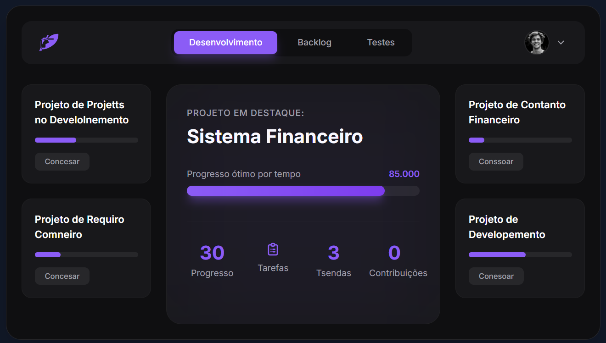
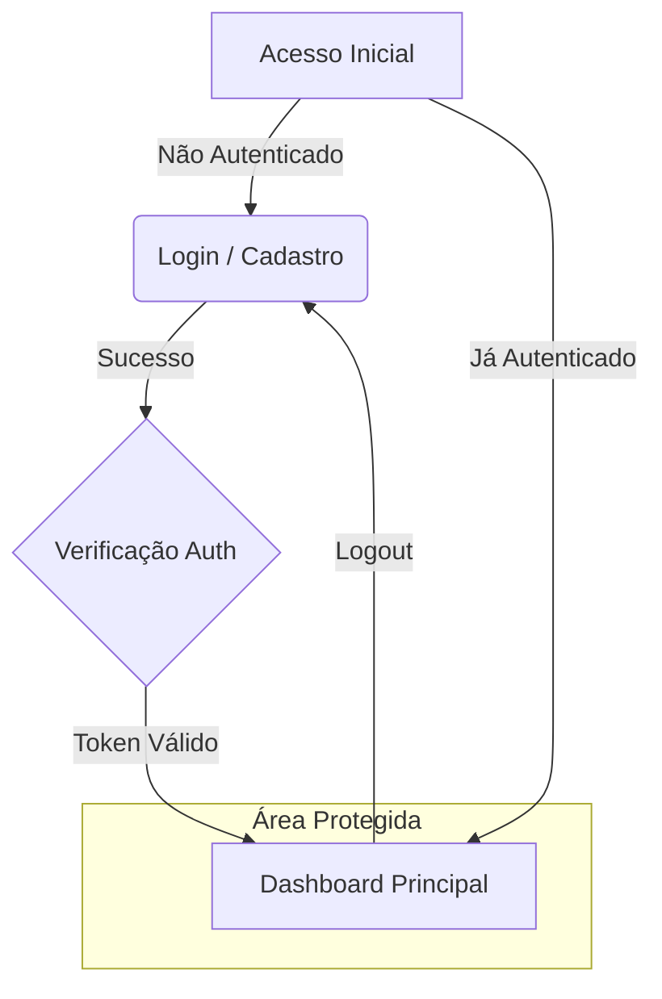

# 🚀 Dashboard de Desenvolvimento - Web & Mobile

Bem-vindo ao **DevDash+**, um dashboard interativo e responsivo projetado para gerenciamento de projetos de desenvolvimento. Este projeto foi transformado de um layout estático para uma aplicação web dinâmica com autenticação e design premium.

## 📋 Sobre o Projeto

O **DevDash** é uma interface moderna construída com **HTML5**, **Tailwind CSS** e **JavaScript**. Ele simula um ambiente SaaS real, oferecendo uma experiência de usuário fluida com temas escuros, glassmorphism e micro-interações.

### ✨ Funcionalidades Principais

-   **🔐 Autenticação Completa**: Sistema de Login e Cadastro com validação.
-   **🛡️ Rotas Protegidas**: O dashboard é acessível apenas para usuários autenticados.
-   **🎨 Design Premium**: Interface Dark Mode com efeitos de vidro (Glassmorphism) e gradientes vibrantes.
-   **📱 Totalmente Responsivo**: Layout adaptável que funciona perfeitamente em Desktop e Mobile.
-   **⚡ Mock Backend**: Simulação de banco de dados usando `localStorage` (preparado para migração Supabase).

---

## 🔄 Fluxo da Aplicação

Abaixo está o fluxo de navegação do usuário dentro da aplicação:

---

## 🛠️ Tecnologias Utilizadas

-   **Frontend**: HTML5, JavaScript (ES6+)
-   **Estilização**: Tailwind CSS (via CDN)
-   **Ícones**: Heroicons (SVG)
-   **Fontes**: Inter (Google Fonts)

---

## 📱 Preview Mobile

O layout foi pensado Mobile-First, garantindo uma experiência incrível em telas menores.

## 🚀 Como Executar

1.  Clone o repositório ou baixe os arquivos.
2.  Abra o arquivo `index.html` em seu navegador.
3.  Você será redirecionado para o Login.
4.  Crie uma conta em "Criar conta" e explore o dashboard!

---

  Desenvolvido com 💜 e Tailwind CSS

